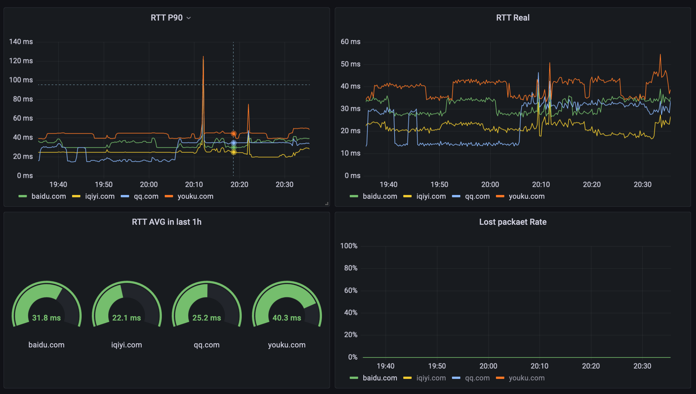

# ping_exporter
A Prometheus export that uses ping to monitor network quality  


## usage
- **build**: `go build`
- **run**: `sudo ./ping_exporter`  
send icmp packet must have root privileges.  
  

## configuration
See config.yml

## metrics
- **ping_rtt**: round-trip time of icmp packets, in milliseconds, Histogram 
- **ping_failed_count**: total number of ping failures  
- **ping_timeout_count**: total number of ping timeout
- **ping_rtt_real**: like ping_rtt, but updated in real time through Gauge

## http url
The default URL is http://{host}:2112/metrics

## prometheus example
- **RTT P90:**  
```histogram_quantile(0.9, rate(ping_rtt_bucket[$__rate_interval]))```
- **RTT AVG in last 1h:**  
```rate(ping_rtt_sum[1h]) / rate(ping_rtt_count[1h])```
- **Lost packet Rate:**  
```rate(ping_timeout_count[$__rate_interval]) / (rate(ping_timeout_count[$__rate_interval]) + rate(ping_rtt_count[$__rate_interval]))```
- **RTT over 30ms Rate:**   
```(rate(ping_rtt_count[$__rate_interval]) - sum without(le) (rate(ping_rtt_bucket{le="30"}[$__rate_interval]))) / rate(ping_rtt_count[$__rate_interval])```
